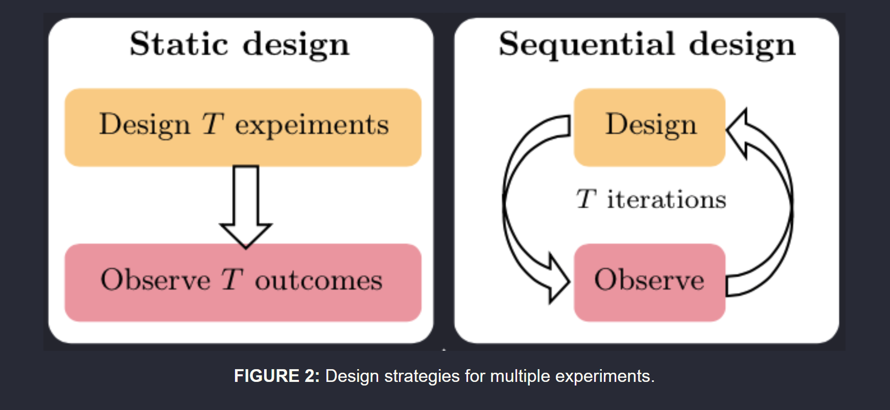
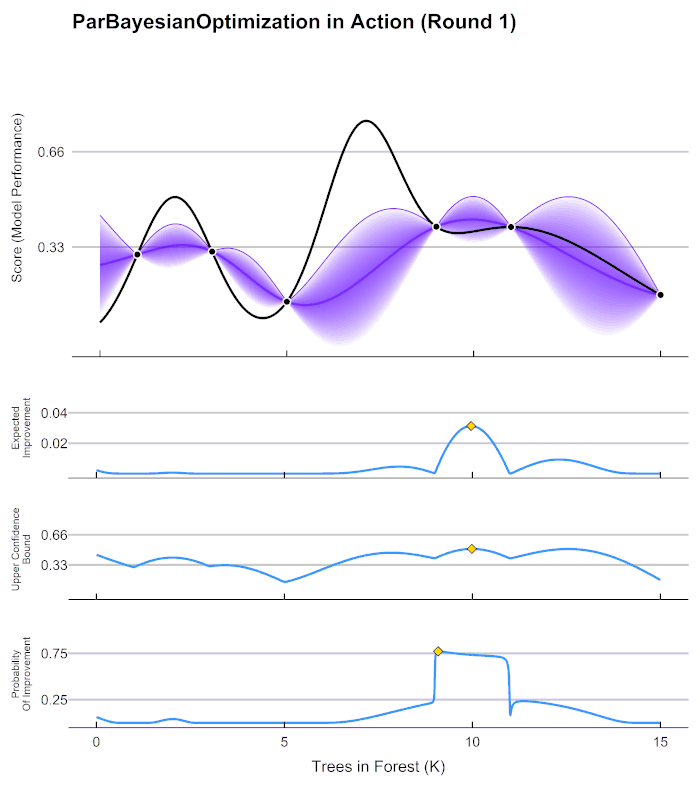

## General theory

### First of all - what are we doing here? 

I would say that we are proposing a **"new" method for experimental design**. Ok - it is not very new, but it has not been widely applied in this field and it has never been applied to this particular material (that is where the novelty lies). 
Maybe [this paper](https://ieeexplore.ieee.org/stamp/stamp.jsp?tp=&arnumber=8957442) best puts Bayesian optimization in the context of experimental design and compares it to alternatives (such as factorial design or central composite design). 

### Bayesian experimental design - using Bayesian optimization for experimental design!

I found [this cool blogpost](https://desirivanova.com/post/boed-intro/) on Bayesian experimental design. I think this is what we are doing here too - instead of (or hand-in-hand with) the static factorial design we are trying out something new. One of the key differences between them is that BO is sequential (aka adaptive) - we learn from our data sample at the time and it helps us guide the experiments. On the other hand, factorial design is static - you need to collect all the data and then do the analysis.

It will be interesting to read the two main papers that they mention in the blogpost [Ryan et. al (2016)](https://core.ac.uk/download/pdf/45314624.pdf) which gives an overview of Bayesian experimental design. But also very interesting new work from [Foster et. al (2021)](https://proceedings.mlr.press/v139/foster21a.html) where they propose using some deep learning approaches as an alternative to the classic bayesian optimization. (they are veeeery technical though so maybe later when we have time!)

### What is experimental design??

I was not so familiar with the topic of experimental design (you probably know more about it) so I had to google it. I found the start of the above blogpost useful:

_What questions should we ask in an online survey? Which point should we query next in an active learning loop? Where should we place sensors, e.g. to detect faults and defects most efficiently? These, and many more, seemingly distinct questions constitute the same fundamental problem—designing experiments to collect data that will help us learn about an underlying process._

In our case the question we are trying to answer can be framed as:

___What printing parameters should we use in order to successfully print the newly composed material?___

With that in mind here is some high-level clarification about the work in your SA2 that can be helpful to see the bigger picture. 

- **The experiment is:**
printing useful scafolds with the new material.
- **Input variables are:**
pressure, speed, needle gauge
- **Goal of the experiment:**
printing the material with high material accuracy 

Overall, in your SA2.1 I think you want to see what are the benefits of the Bayesian experimental design as compared to the full-factorial design. And you can use the insights found here for the other materials too in SA2.2 and SA2.3 . Importantly - if the Bayesian experiment design shows no benefits for your analysis you can continue with the rest of the work and the full-factorial design as a backup.

## Technical theory 
### Bayesian optimization: behind the scenes

I had to brush up on my understanding of Bayesian optimization a little bit and I summarize it here:

#### O in Bayesian Optimization

What does BO do? The secret is in the O - optimization. It is a mathematical method for global optimization of a "black-box" function. 

Optimization means that we are searching the search space looking for a minimum/maximum of a function.
Global optimization (in my understanding) means that we are searching throughout a wide range of input values (so we are not just looking at a small subset of the search space). Some other global optimization techniques are _stochastic_ (monte carlo or genetic algorithms) and others are _deterministic_ (very numerical precise math based approaches as applied to linear programming or mixed integer programming).

So, nothing fancy really - all we want is to find out which inputs will give us the optimal output. But how?

#### B in Bayesian Optimization

How does BO optimize? The secret us in the B - in a Bayesian way. 

When we say Bayesian in CS and math we usually associate this with the some probabilistic interpretation of our variables and terms like: prior probability, update of belief, posterior probability. Overall we have a probabilistic view of the world: are variables are uncertain and any evidence we get we update some probabilities (using Bayes rule - hence Bayesian). But what do probabilities have to do with optimization?

BO kinda follows these steps:

- I have a black-box function that I am trying to find the optimum point for

- I am going to assume that all possible functions are inside this black-box

- I am going to assign probabilities to each of these functions

- When I get new evidence I will update my probabilities (beliefs) associated with the functions

- I will ask for new evidence (exploration/exploitation trade-off)

- Until the evidence narrows down the probabilities and I am mostly left with a single "most probable" function

- Now that I have narrowed down my function it is no longer black box and I also know it's global minimum/maximum!

So, to summarize we can group the steps into:

1. Formally describe the black-box as a "group of possible functions" and relate an associated probability with it, initialize with some points
2. Based on the black-box estimate - formulate an aquisition function (this is an actual function that has a clear maximum)
3. Choose the next evaluation point using the aquisition function
4. Call the black-box for this point 
5. Update the beliefe on the black-box "group of possible functions"

Then we repeat 2-4 until we are happy with our results.

Mathematically the algorithms/equations associated with these steps are usually the following ([these slides](http://www.cs.toronto.edu/~rsalakhu/STAD68/notes/Lecture7_2014.pdf) were useful):

1. Gaussian Process formulation (although this could be replaced with an alternative method)

    - gaussian processes are a useful formal way to note down a set of many possible functions that have some nice mathematical properties that make it cool/easy to work with
    - gaussian process: a random function where the probabilities associated with the functions are gaussian for every subset of the variables
    - they can be fully described by their covariance matrixes (some math magic) which makes some of the next steps doable
    - initialization of the gaussian process: fitting the gaussian process to the initial data (Kriging) this is also the most expensive computational step (slides show explanation - it is ^3 with respect to number of examples)
    - as a result: we get the probability distibution over the possible function (including the variance) - and this kinda tells us where is the maximum likely to be and where variance is high (and we need to search more)
    
    
2. Formulation of an acquisition function:

    - Many different ways to formalize the exploration/exploitation trade-off:
    - Expected improvement, upper confidence bounds, thompson sampling

3. Picking for the maximum of the aquisition function for the next evaluation point:

    - Acquisition functions are designed so that it's fairly easy to find their maximum (usually numerical methods, quasi Newtonian)
    - as a result: we picked the next point to evaluate with the black-box
    
    
4. Call the black-box for this point:

    - do the experiment :D 
    
    
5. Gaussian Process Regression 
 
    - the expensive step again - back to 2 (until convergence or some other criteria)
